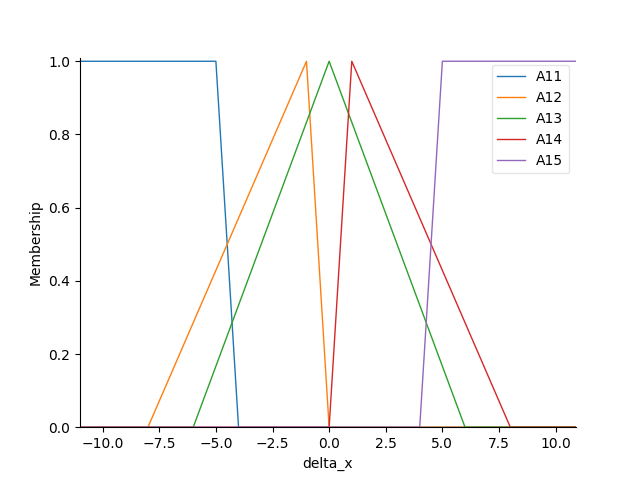
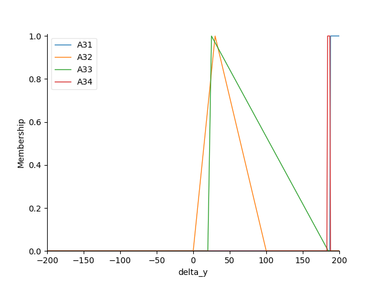
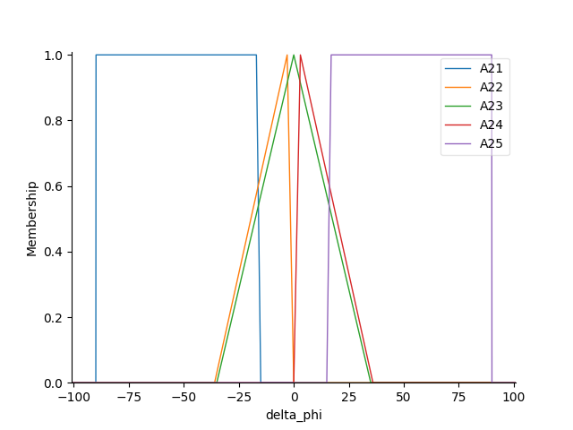
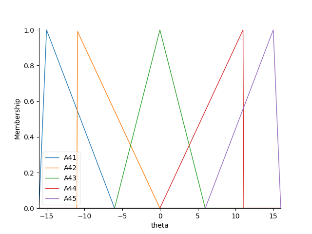
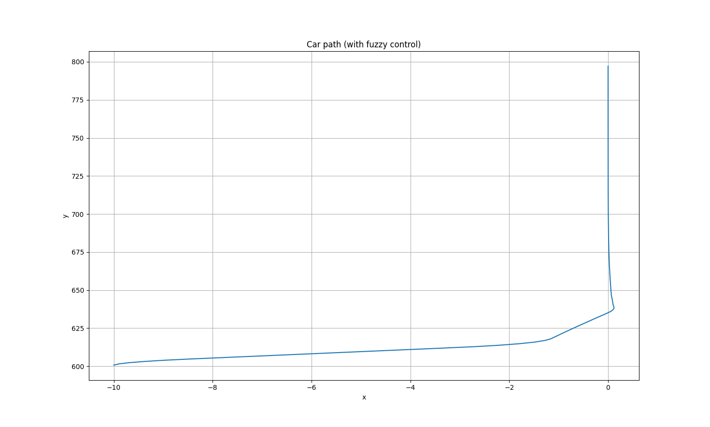

# 嘉義大學 113-2 智慧型控制 期末作業
    github連結:<https://github.com/Hankswsy/NCYU_Intelligent-Control>
## Q1:請設計三輸入(delta x、delta y、delta phi)的停車系統模糊控制器，並於y=700時滿足x趨近0、phi趨近90度。  
### 程式碼
```python {.line-numbers}
    import math
    import numpy
    import skfuzzy.control
    import matplotlib.pyplot as plt

    def Car_Kinematics_Model(x, y, phi, theta):
        phi = phi / 180 * math.pi
        theta = theta / 180 * math.pi
        x = x + math.cos(phi + theta) + math.sin(phi) * math.sin(theta)
        y = y + math.sin(phi + theta) - math.sin(phi) * math.sin(theta)
        phi = phi - math.asin(2 * math.sin(theta) / 4)  # 4為車長
        phi = phi / math.pi * 180
        return x, y, phi

    def Fuzzy_Controller(V1, V2, V3):  # V1: delta_x, V2: delta_phi, V3: delta_y

        universe_delta_x=numpy.arange(-11,11,0.1) # delta x
        universe_delta_phi=numpy.arange(-101,101,0.1) # delta phi
        universe_theta=numpy.arange(-16,16.1,0.1) # theta
        universe_delta_y=numpy.arange(-200, 200.1, 1)

        delta_y = skfuzzy.control.Antecedent(universe_delta_y, 'delta_y')
        delta_x=skfuzzy.control.Antecedent(universe_delta_x,'delta_x')
        delta_phi=skfuzzy.control.Antecedent(universe_delta_phi,'delta_phi')
        theta=skfuzzy.control.Consequent(universe_theta,'theta')

        delta_x['A11'] = skfuzzy.trapmf(universe_delta_x, [-11, -11, -5, -4])  # 極左
        delta_x['A12'] = skfuzzy.trimf(universe_delta_x, [-8, -1, 0])          # 左
        delta_x['A13'] = skfuzzy.trimf(universe_delta_x, [-6, 0, 6])           # 左右偏中
        delta_x['A14'] = skfuzzy.trimf(universe_delta_x, [0, 1, 8])            # 右
        delta_x['A15'] = skfuzzy.trapmf(universe_delta_x, [4, 5, 11, 11])      # 極右

        delta_phi['A21'] = skfuzzy.trapmf(universe_delta_phi, [-90, -90, -17, -15])       # 車尾極左
        delta_phi['A22'] = skfuzzy.trimf(universe_delta_phi, [-36, -3, 0])               # 車尾大左
        delta_phi['A23'] = skfuzzy.trimf(universe_delta_phi, [-35, 0, 35])                # 車尾直行
        delta_phi['A24'] = skfuzzy.trimf(universe_delta_phi, [0, 3, 36])                 # 車尾大右
        delta_phi['A25'] = skfuzzy.trapmf(universe_delta_phi, [15, 17, 90, 90])           # 車尾極右

        delta_y['A31'] = skfuzzy.trapmf(universe_delta_y, [187, 188, 200, 201])
        delta_y['A32'] = skfuzzy.trimf(universe_delta_y, [0, 30, 100])
        delta_y['A33'] = skfuzzy.trimf(universe_delta_y, [20, 25, 185])
        delta_y['A34'] = skfuzzy.trapmf(universe_delta_y, [183, 184, 187, 188])    

        theta['A41'] = skfuzzy.trimf(universe_theta, [-16, -15, -6])   # 大左
        theta['A42'] = skfuzzy.trimf(universe_theta, [-11, -11, 0])     # 小左
        theta['A43'] = skfuzzy.trimf(universe_theta, [-6, 0, 6])       # 直行
        theta['A44'] = skfuzzy.trimf(universe_theta, [0, 11, 11])       # 小右
        theta['A45'] = skfuzzy.trimf(universe_theta, [6, 15, 16])      # 大右

        theta.defuzzify_method='centroid' # 重心法

        # delta_x.view()
        # delta_phi.view()
        # delta_y.view()
        # theta.view()
        # plt.show()

        # rule base
        rule1=skfuzzy.control.Rule(antecedent=((delta_x['A11']&delta_phi['A23']&delta_y['A33'])|
                                            (delta_x['A12']&delta_phi['A23']&delta_y['A33'])|
                                            (delta_x['A12']&delta_phi['A24']&delta_y['A33'])|
                                            (delta_x['A13']&delta_phi['A24']&delta_y['A33'])|
                                            (delta_x['A12']&delta_phi['A24']&delta_y['A32'])),consequent=theta['A44'],label='turning right')
        rule2=skfuzzy.control.Rule(antecedent=((delta_x['A11']&delta_phi['A22']&delta_y['A33'])|
                                            (delta_x['A13']&delta_phi['A23']&delta_y['A33'])|
                                            (delta_x['A14']&delta_phi['A24']&delta_y['A33'])|
                                            (delta_x['A13']&delta_phi['A23']&delta_y['A32'])),consequent=theta['A43'],label='turning straight')
        rule3=skfuzzy.control.Rule(antecedent=((delta_x['A13']&delta_phi['A22']&delta_y['A33'])|
                                            (delta_x['A12']&delta_phi['A22']&delta_y['A33'])|
                                            (delta_x['A14']&delta_phi['A22']&delta_y['A33'])|
                                            (delta_x['A14']&delta_phi['A23']&delta_y['A33'])|
                                            (delta_x['A14']&delta_phi['A22']&delta_y['A32'])),consequent=theta['A42'],label='turning left')
        rule4=skfuzzy.control.Rule(antecedent=((delta_x['A11']&delta_phi['A23']&delta_y['A31'])),consequent=theta['A45'],label='turning hard right')
        rule5=skfuzzy.control.Rule(antecedent=((delta_x['A11']&delta_phi['A23']&delta_y['A34'])|
                                            (delta_x['A12']&delta_phi['A23']&delta_y['A34'])|
                                            (delta_x['A11']&delta_phi['A22']&delta_y['A34'])|
                                            (delta_x['A12']&delta_phi['A22']&delta_y['A34'])),consequent=theta['A41'],label='turning hard left')


        system = skfuzzy.control.ControlSystem(rules=[rule1, rule2, rule3, rule4, rule5])
        sim = skfuzzy.control.ControlSystemSimulation(system)

        sim.input['delta_x'] = V1
        sim.input['delta_phi'] = V2
        sim.input['delta_y'] = V3

        try:
            sim.compute()
        except Exception as e:
            print(f"Error in fuzzy computation: {e}")
            return 0  


    # Initial values
    x = -10
    y = 600
    phi = 90

    
            return sim.output['theta']
    x_pos = [0] * 200
    y_pos = [0] * 200

    for t in range(0,200,1):
        delta_x = x - 0
        delta_phi = phi - 90
        delta_y = abs(y - 800)
        theta=Fuzzy_Controller(delta_x, delta_phi, delta_y)
        x,y,phi=Car_Kinematics_Model(x,y,phi,theta)
        x_pos[t]=x
        y_pos[t]=y

    plt.plot(x_pos,y_pos)
    plt.xlabel("x")
    plt.ylabel("y")
    plt.title("Car path (with fuzzy control)")
    plt.grid(True)
    plt.show()
```

### 執行結果
#### Membership Functions
##### Delta_x

##### Delta_y

##### Delta_phi

##### Delta_theta


#### Car path



## Q2:請求出"期末作業2.pdf"中的delta x、delta y、delta phi。

### 程式碼
```python {.line-numbers}
    import math
    import numpy as np
    import cv2
    import matplotlib.pyplot as plt
    import matplotlib.image as plotimg

    def out_x_y(matrix):
        x = matrix[0]/matrix[2]
        y = matrix[1]/matrix[2]
        # print(x,y)
        return x, y

    def angle_with_x_axis(A, B):
        dx = B[0] - A[0]
        dy = B[1] - A[1]
        angle_rad = math.atan2(dy, dx)
        angle_deg = math.degrees(angle_rad)
        return angle_deg

    def distance_from_C_to_line_AB(A,B,C):
        numerator=abs((B[1]-A[1])*C[0]-(B[0]-A[0])*C[1]+B[0]*A[1]-B[1]*A[0])
        denominator=math.sqrt((B[1]-A[1]) ** 2+(B[0]-A[0]) ** 2)
        return numerator/denominator

    def find_perpendicular_point_D(A,B,C):
        A=np.array(A)
        B=np.array(B)
        C=np.array(C)
        # 計算向量 AB 和 AC
        AB=B-A
        AC=C-A
        # 計算 t，使得 D = A + t * AB 是 C 到 AB 的垂足
        t=np.dot(AC,AB)/np.dot(AB,AB)
        # 計算點 D 的座標
        D=A+t*AB
        return D

    def rotate_point(x,y,theta_deg):
        theta_rad=math.radians(theta_deg)
        x_new=x*math.cos(theta_rad)-y*math.sin(theta_rad)
        y_new=x*math.sin(theta_rad)+y*math.cos(theta_rad)
        return x_new, y_new

    matrix = np.array([ [1.4237457108004437, -0.717919420091444, -403.8109154095238],
                        [0.0009548131181493375, 0.19893812144029333, 16],
                        [0.00005967581988433359, -0.000782903852698234, 1]])

    xyp = [[ 922, 381],
        [1377, 226],
        [1900, 344],
        [1506, 604]]

    xy =[]
    car=[960,1080]
    img = plotimg.imread('44.jpg')

    try:
        inverse_matrix = np.linalg.inv(matrix)
        for i in xyp:
            rd = out_x_y(np.matmul(inverse_matrix, [i[0], i[1], 1]).tolist())
            xy.append(rd)

        # print(xy)
        
        
    except np.linalg.LinAlgError:
        print("error!!")


    D=find_perpendicular_point_D((xy[0][0],1080-xy[0][1]),(xy[3][0],1080-xy[3][1]),(car[0],car[1]))
    # print(f'點D座標:({D[0]:>7.2f},{1080-D[1]:>7.2f})')

    delta_y=math.sqrt((D[0]-car[0]) ** 2+(D[1]-car[1]) ** 2)/6
    # print('delta_y=',delta_y)

    delta_phi = -angle_with_x_axis((xy[0][0], 1080 - xy[0][1]), (xy[3][0], 1080 - xy[3][1]))
    # print('delta_phi=', delta_phi)

    x_new,y_new=rotate_point(D[0]-(xy[0][0]+xy[3][0])/2,D[1]-(1080-xy[0][1]+1080-xy[3][1])/2,delta_phi)
    delta_x=x_new/6
    # print('delta_x=',delta_x)

    car[0],car[1]=out_x_y(np.matmul(inverse_matrix, [car[0],car[1], 1]).tolist())
    # print(f'車子座標：({car[0]:>7.2f},{car[1]:>7.2f})')


    h, w = img.shape[:2]
    size = (w, h)  

    # 做透視轉換
    warped = cv2.warpPerspective(img, np.linalg.inv(matrix), size)

    warped_rgb = cv2.cvtColor(warped, cv2.COLOR_BGR2RGB)
    plt.imshow(warped_rgb)
    plt.title("Image after perspective transformation")
    plt.axis('off')
    plt.show()

    # 要標的點
    points = np.vstack((xy, [ [car[0], car[1]] ]))
    # 顯示圖片
    plt.imshow(warped_rgb)
    for i, (x, y) in enumerate(points):
        plt.plot(x, y, 'ro')  # 標紅點
        plt.text(x + 10, y - 10, f'P{i}', color='green', fontsize=12)
    plt.title("Image after perspective transformation")
    plt.axis('off')
    plt.show()

    # 結果
    print(f'車子座標 :({car[0]:>7.2f},{car[1]:>7.2f})')

    for i in range(len(xy)):
        print(f'第{i:1d}點座標：({xy[i][0]:>7.2f},{xy[i][1]:>7.2f})')

    print('delta_x=',delta_x)
    print('delta_y=',delta_y)
    print('delta_phi=',delta_phi)
```

### 執行結果
